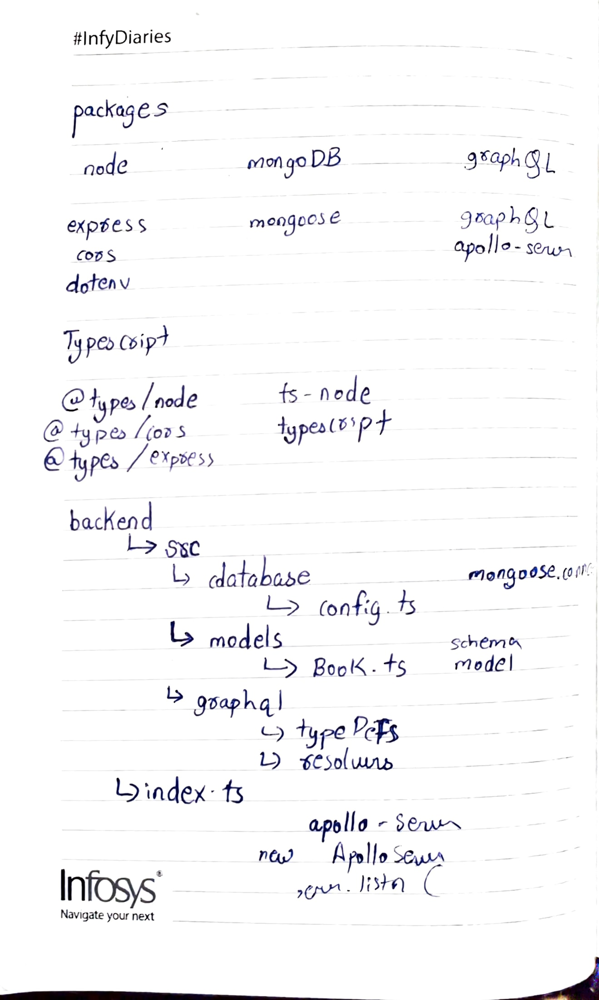

# Daily Updates

##### 17/02 -> Setup of typescript, node with apollo-server (graphql) and mongoose

##### 18/02 -> Mongo DB setup and graphql typeDefs

##### 19/02 -> Graphql Resolvers and folder structure

# Packages

### Node packages

- express
- dotenv
- cors

### Graphql packages

- graphql
- apollo-server

### MongoDB

- mongoose

### Dev packages for typescript

- typescript
- @types/nodes
- @types/express
- @types/cors
- ts-node

# Commands

- npx tsc --init

